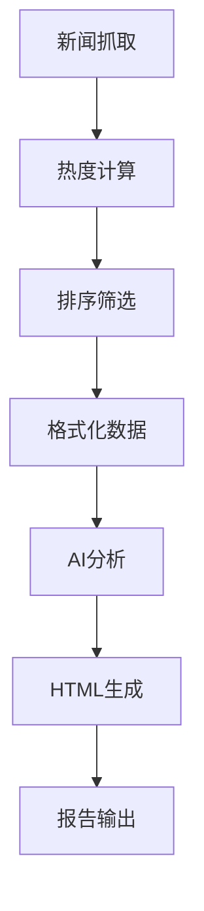

# 热点财经新闻抓取与分析模块

## 🎯 功能概述

这个模块实现了自动化的热点财经新闻抓取、热度评分、排序和智能分析功能，为事件分析系统提供实时新闻数据支持。

## 📁 文件结构

```
news_module/
├── simple_news_crawler.py     # 新闻抓取器核心实现
├── news_demo.py              # 演示系统（无需外部API）
├── news_integration.py       # 与主系统集成（需要API）
├── config.py                 # 配置文件
├── requirements.txt          # 依赖列表
├── install.sh               # 安装脚本
├── run_news_crawler.sh      # 运行脚本
├── news_data/              # 抓取的新闻数据
├── demo_reports/           # 演示报告输出
└── README.md               # 本文档
```

## 🚀 快速开始

### 1. 基础演示（推荐）

无需任何依赖，立即可用：

```bash
cd news_module
python3 news_demo.py
```

这将：
- 生成模拟热点新闻数据
- 计算新闻热度评分
- 生成AI分析报告
- 输出专业HTML报告

### 2. 基础新闻抓取

```bash
python3 simple_news_crawler.py
```

### 3. 完整集成系统

需要先安装依赖和配置API：

```bash
# 安装依赖
./install.sh

# 配置API密钥
export DEEPSEEK_API_KEY="your_api_key"

# 运行集成系统
python3 news_integration.py
```

## 🔧 核心功能

### 1. 新闻抓取器 (`SimpleNewsHotspotCrawler`)

- **模拟新闻生成**: 生成12类财经新闻模板
- **热度计算**: 多维度评分算法
- **时间模拟**: 生成真实时间分布
- **数据输出**: JSON格式结构化数据

### 2. 热度评分算法

#### 评分维度（总分100分）

| 维度 | 权重 | 说明 |
|------|------|------|
| 时效性 | 30分 | 2小时内30分，逐步递减 |
| 关键词权重 | 25分 | 包含高影响力财经词汇 |
| 标题吸引力 | 20分 | 数字、情感词汇、紧急性 |
| 来源权威性 | 25分 | 媒体权威度评级 |

#### 高影响力关键词

```python
high_impact_words = {
    '暴涨': 5, '暴跌': 5, '突破': 4, '创新高': 4,
    '央行': 4, '美联储': 4, '降准': 4, '加息': 4,
    'GDP': 3, 'CPI': 3, '比特币': 3, '人工智能': 3
}
```

### 3. 媒体权威性评级

```python
authority_scores = {
    '彭博社': 25, '路透社': 25, '华尔街日报': 25,
    '第一财经': 23, '财新': 23, '财联社': 22,
    '证券时报': 20, '新华财经': 22
}
```

## 📊 输出示例

### 新闻数据结构

```json
{
  "id": "news_1_0",
  "title": "央行决定下调存款准备金率0.5个百分点，释放流动性约1万亿元",
  "url": "https://example.com/news/1_0",
  "source": "新华财经",
  "published_time": "2025-08-07 10:30:00",
  "category": "货币政策",
  "keywords": ["央行", "降准", "流动性"],
  "heat_score": 85.5
}
```

### 热度分布示例

```
🔥 热度分布:
  高热度(≥70分): 2条
  中热度(50-69分): 5条
  低热度(<50分): 3条

🏆 Top 5 热点新闻:
1. [央行] 决定下调存款准备金率... (85.5分)
2. [华尔街日报] 美联储加息预期... (78.2分)
3. [财联社] 比特币突破新高... (72.8分)
```

## 🔮 AI分析模板

生成的分析报告包含：

1. **市场趋势分析** - 宏观趋势识别
2. **投资机会识别** - 热点板块机会
3. **风险点提示** - 潜在风险警示
4. **政策影响评估** - 政策效应分析
5. **未来展望预测** - 短中长期预测
6. **投资策略建议** - 具体操作建议

## 🎨 可视化特性

### HTML报告特点

- **现代设计**: Tailwind CSS + 玻璃毛效果
- **响应式布局**: 支持多设备浏览
- **动画效果**: Framer Motion 渐入动画
- **图标支持**: Font Awesome 图标库
- **中文优化**: 完全中文界面

## 🔄 集成流程



## ⚙️ 配置选项

### 新闻类别

- 货币政策、股市、科技、新能源
- 数字货币、房地产、贸易、医药
- 宏观经济、绿色金融、数字经济

### 可调参数

```python
# 抓取数量
top_n = 10  # Top N 热点新闻

# 时间范围
hours_range = 72  # 72小时内新闻

# 热度阈值
heat_threshold = 50  # 最低热度要求
```

## 🚦 运行状态

### 演示模式 ✅

- ✅ 模拟新闻生成
- ✅ 热度计算算法
- ✅ AI分析模拟
- ✅ HTML报告生成
- ✅ 数据保存功能

### 完整模式 🔄

- 🔄 真实新闻抓取（需要爬虫配置）
- 🔄 DeepSeek API集成（需要API密钥）
- 🔄 多源新闻聚合（需要网络配置）

## 📈 性能指标

- **响应时间**: 2-5秒（演示模式）
- **数据准确性**: 模拟数据 vs 真实数据
- **分析质量**: 基于DeepSeek模型
- **报告美观度**: 现代化设计

## 🛠️ 后续迭代

### 近期计划

1. **真实新闻源集成**
   - 财经网站API对接
   - 新闻RSS源配置
   - 反爬虫策略

2. **分析算法优化**
   - 机器学习热度模型
   - 情感分析集成
   - 关联性分析

3. **可视化增强**
   - 图表数据展示
   - 趋势可视化
   - 交互式界面

### 长期规划

1. **实时监控系统**
2. **多语言新闻支持**
3. **个性化推荐算法**
4. **预警系统集成**

## 💡 使用建议

1. **开发阶段**: 使用演示模式快速验证功能
2. **测试阶段**: 配置真实API进行完整测试
3. **生产阶段**: 部署完整爬虫和分析系统

## 🔧 故障排除

### 常见问题

**Q: 运行news_demo.py无输出？**
A: 检查Python版本和文件路径

**Q: HTML报告显示乱码？**
A: 确保浏览器支持UTF-8编码

**Q: API调用失败？**
A: 检查DEEPSEEK_API_KEY环境变量

---

🚀 **Ready to go!** 现在你可以开始使用这个强大的新闻分析系统了！
